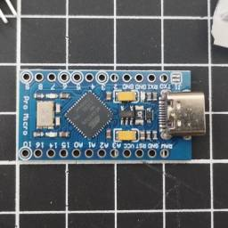
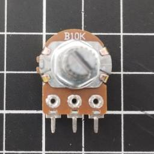
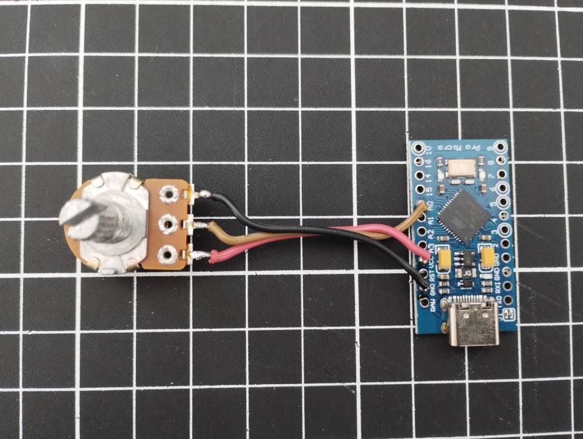

# Arduino Analog Handbrake Self-Adjusting

# Requirements

- 1x Arduino Pro Micro

  

- 1x Potentiometer B10k (You can try others values)

  

- 1x Handbrake Estructure

  Examples

  - https://www.thingiverse.com/thing:2915581
  - https://www.thingiverse.com/thing:2204323

# Wiring

